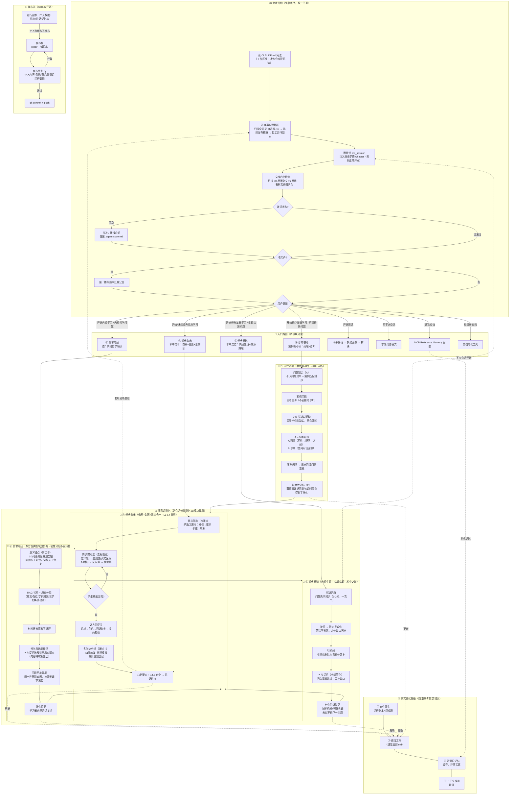

# Agent 逻辑图（中医经典教学系统 · 四模块完整生命周期）

> 本图描述"我们这个 agent"从会话开始到发布推送的完整逻辑链路，含**四大课程模块**各自的流程。
> 渲染：Obsidian / GitHub 直接显示；纯文本阅读可看文末"文字版流程"。



## 文字版流程（不渲染时的阅读顺序）

```
会话开始（四模块共用）
 ├─ ① 读双宪法 → ② 进度事实源解析 → ③ 潜意识 pre_session → ④ 文档内化检测 → ⑤ 激活检查 → ⑥ 老用户判定
入口路由：触发词/直接提问 → 四模块分流（临床/内经/基础/诊疗）+ 测试 + 学派交流 + 显式记忆 + 文档内化

模块① 经典临床（伤寒+金匮+温病合一 · L1-L4）
 意义锚点 → 矛盾点漏斗（接住→推向→卡住→填补）
 → 四步提问（定义/应用/反向/发散，真实医案A-D档）
 → 学生给方 → 处方验证关 → 多学派分析（四层触发，漏=违规登记）
 → 总结+14.7自查 → 笔记+进度 → 潜意识记录

模块② 黄帝内经（哲学精读 · 密度分层，不设评估）
 意义锚点（1-3问凿世界观空缺）
 → RAG检索/原文分类 → 材料直出（原文/白话/字词/哲学关联/多注家）
 → 哲学思辨层循环（五步提问溶解进漏斗）
 → 密度分层呈现 → 外化验证（复述）

模块③ 经典基础（内经生理+病源病理）
 空缺开场 → 接住→推向显式化 → 引机制
 → 五步提问（去标签，已会跳过）
 → 外化验证锁死（复述机制+预演失调，未过不进下一主题）

模块④ 诊疗基础（案例驱动桥）
 问题锚定（个人问题清单）→ 案例呈现（不给诊断）
 → 345步缺口驱动（只补卡住的缺口）
 → A→B两阶段（A药理：药性→配伍→方剂 / B诊断：望闻问切画像）
 → 案例闭环回填 → 鼓励性总结（潜意识数据驱动）

共享层
 潜意识记忆闭环（记录→管道→whisper→下次会话）
 事实源：文件 > 进度文件 > 潜意识记忆 > 上下文推测
 发布流：运行副本（个人数据留本地）→ 发布版 → 发布检查 → commit+push
```

## 四模块异同速查

| 维度 | 经典临床 | 黄帝内经 | 经典基础 | 诊疗基础 |
|:---|:---|:---|:---|:---|
| 定位 | 术中之术 | 道 | 术中之道 | 案例驱动桥 |
| 内容 | 伤寒+金匮+温病合一 | 内经哲学精读 | 内经生理+病源病理 | 药理+诊断 |
| 开场 | 意义锚点（矛盾点漏斗） | 意义锚点（世界观空缺） | 空缺开场 | 问题锚定 |
| 提问 | 四步提问法 | 五步提问溶解进漏斗 | 五步提问（去标签） | 345步缺口驱动 |
| 特殊环节 | 处方验证关+多学派 | 密度分层（不设评估） | 外化验证锁死 | A→B两阶段 |
| 记忆共享 | ✅ 潜意识 | ✅ 潜意识 | ✅ 潜意识 | ✅ 潜意识 |

## 三个防错机制（架构级）

| 机制 | 防什么 | 位置 |
|:---|:---|:---|
| 进度事实源解析 | 把发布模板当进度 → 重新考教老用户 | 双宪法 ★ 章节 |
| 执行违规登记 | 漏强制环节（多学派/意义锚点）复发 | 进度追踪.md 账本 + 课程流程 |
| 发布检查.py | 个人内容/盘符/密钥/潜意识数据入库 | 发布前自动拦截 |

## DSH 环境工具层

```
DeepSeek Harness (host)
 ├─ MCP Reference Memory（跨会话显式记忆图谱）
 ├─ subconscious（潜意识学情记忆，四模块共用，零配置）
 ├─ dsh-pocket（手机访问：局域网扫码/公网隧道）
 ├─ dshmarket（插件市场：1250+ 插件）
 └─ dsh-desktop（Electron 桌面端：系统托盘+独立窗口）
```
