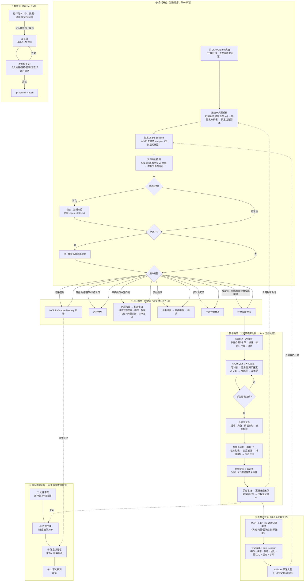

# Agent 逻辑图（中医经典教学系统 · 完整生命周期）

> 本图描述"我们这个 agent"从会话开始到发布推送的完整逻辑链路。
> 渲染：Obsidian / GitHub 直接显示；纯文本阅读可看文末"文字版流程"。



## 文字版流程（不渲染时的阅读顺序）

```
会话开始
 ├─ ① 读双宪法（工作区 CLAUDE.md + 发布仓库 CLAUDE.md）
 ├─ ② 进度事实源解析：扫描全部进度追踪.md → 排除发布模板 → 锁定运行副本（19课进度在这）
 ├─ ③ 潜意识 pre_session：注入历史学情（温病三宝跳过、L2画像、进度约束…）
 ├─ ④ 文档内化检测：扫描 00-原著全文 vs 基线（157文件基线已建）
 ├─ ⑤ 激活检查：.agent-state.md 存在 → 已激活，不重复播报
 └─ ⑥ 老用户判定 → 是则播报迁移公告
入口路由
 ├─ 触发词 → 对应模块；直接提问 → 问题归类判模块
 ├─ 开始测试 → 水平评估；多学派交流 → 讨论模式；记住/查询 → MCP图谱
教学循环（经典临床）
 ├─ 意义锚点 → 矛盾点漏斗（接住→推向→卡住→填补，百分百收敛）
 ├─ 四步提问法（定义/应用/反向/发散，真实医案 A-D 档）
 ├─ 学生给方 → 处方验证关 → 多学派分析（四层触发，漏=违规登记）
 ├─ 总结 + 14.7 自查 → 保存笔记 + 更新进度
 └─ 潜意识静默记录学情 → 收尾管道 → whisper 注入包 → 下次会话
事实源：文件 > 进度文件 > 潜意识记忆 > 上下文推测
发布流：运行副本（个人数据留本地）→ 发布版 → 发布检查 → commit+push
```

## 三个防错机制（架构级）

| 机制 | 防什么 | 位置 |
|:---|:---|:---|
| 进度事实源解析 | 把发布模板当进度 → 重新考教老用户 | 双宪法 ★ 章节 |
| 执行违规登记 | 漏强制环节（多学派/意义锚点）复发 | 进度追踪.md 账本 + 课程流程步骤5/6 |
| 发布检查.py | 个人内容/盘符/密钥/潜意识数据入库 | 发布前自动拦截 |

## DSH 环境工具层（本次新增）

```
DeepSeek Harness (host)
 ├─ MCP Reference Memory（跨会话显式记忆图谱）
 ├─ subconscious（潜意识学情记忆，零配置）
 ├─ dsh-pocket（手机访问：局域网扫码/公网隧道）
 ├─ dshmarket（插件市场：1250+ 插件）
 └─ dsh-desktop（Electron 桌面端：系统托盘+独立窗口）
```
